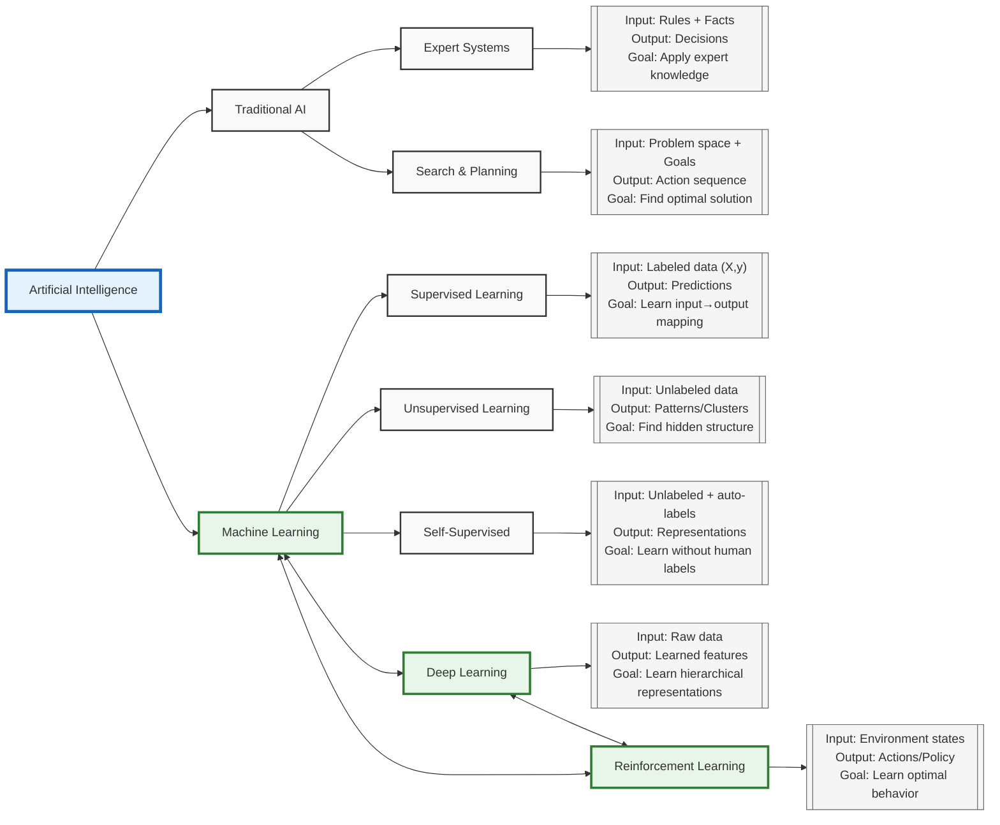

<p align="center">
 
</p>

# IMPORTANT❗
> This project is under maintenance and as such, some files may not run. This will be fixed in due course.

OmniAI provides implementations of foundational AI algorithms from first principles. Built for learning, understanding, and mastering the core concepts of artificial intelligence and machine learning.

## 🌟 Architecture Overview

This repository implements AI algorithms from ground up, focusing on both theoretical foundations and practical implementations. The codebase follows familiar scikit-learn and PyTorch patterns while exposing the underlying mechanics.

## 🗺️ AI Taxonomy



## 🎯 Core Objectives

### Educational Foundation
- Master mathematical foundations through probabilistic and calculus-based approaches
- Understand gradient descent mechanics beyond `.fit()`
- Implement backpropagation from first principles
- Explore probabilistic models (Naive Bayes, GMMs) at a fundamental level

### Technical Mastery
- Debug complex models through deep understanding of internals
- Optimize implementations for specific use cases
- Identify and resolve performance bottlenecks
- Make informed architectural decisions

### Engineering Excellence
- Understand core algorithms at implementation level
- Master mathematical foundations behind each approach
- Learn model limitations and assumptions
- Develop robust debugging strategies

## 🛠️ Implementation Philosophy

While powerful libraries like scikit-learn, PyTorch, and TensorFlow exist, implementing from scratch provides:
- Deep understanding of hyperparameter impacts
- Intuition for algorithm selection
- Recognition of model constraints
- Clear architectural decision-making capability

Most of the implementations will take a blend of scikit-learn and PyTorch form.
## 🧮 Mathematical Approaches

### Probabilistic Methods
- Foundation: Bayes' Theorem and probability theory
- Implementations:
 - Naive Bayes using P(y|X)
 - Gaussian Mixture Models
 - Hidden Markov Models

### Optimisation Methods
- Foundation: Calculus and gradient descent
- Implementations:
 - Linear Regression with MSE optimisation
 - Neural Networks with backpropagation
 - Support Vector Machines with margin maximisation

We will also aim to demonstrate the connection between these two approaches in order to build
a unified interface.
## 🚀 Getting Started

```bash
TBC...
```

## 📖 Documentation

Detailed documentation available in the `/docs` directory:
- Algorithm implementations
- Mathematical derivations
- Usage examples
- Performance benchmarks

## Authors 📚
- Siddartha Nath 
