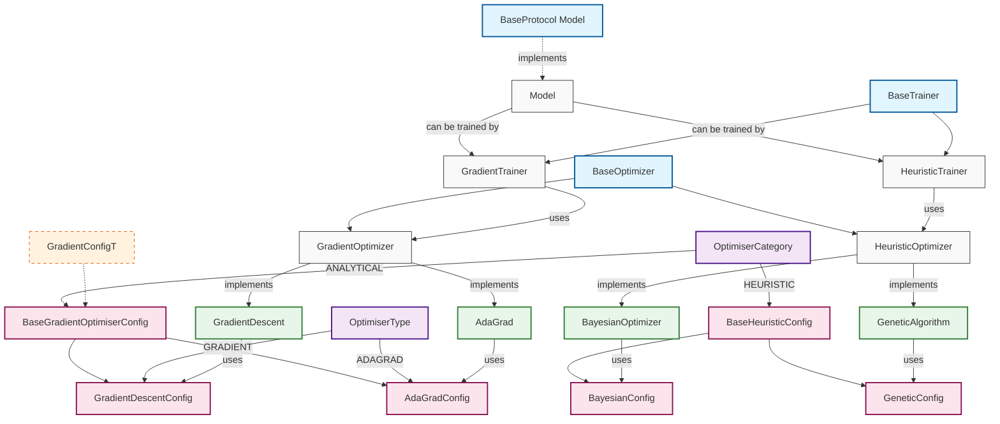

# OmniAI Architecture Design 🏗️

## Overview 📋
This document explains the architecture of the OmniAI library's optimisation and training components. The design uses Python's type system and modern patterns to create a flexible, type-safe, and maintainable codebase.

## Component Hierarchy 🗺️


## Key Components ⚙️

### Models and Protocols 🤖
The Model Protocol defines what a trainable model must implement:
```python
class Model(Protocol):
    def forward(self, X: np.ndarray) -> np.ndarray: ...
    def backward(self, X: np.ndarray, grad_output: np.ndarray) -> None: ...
```

### Optimisation Framework 🔍
 
#### Base Optimiser 🔨
The library distinguishes between two optimisation approaches:
- Gradient-based (analytical solutions)
- Heuristic (non-gradient methods)

#### Gradient Optimiser 🧠
```python
# Works - configs match optimizer type
gd_optimizer = GradientOptimiser(params, GradientDescentConfig(lr=0.01))
adagrad_optimizer = AdaGrad(params, AdaGradConfig(lr=0.01, eps=1e-8))

# Type Errors - configs don't match optimizer type
gd_optimizer = GradientOptimiser(params, AdaGradConfig(...))  # Type Error
adagrad_optimizer = AdaGrad(params, GradientDescentConfig(...))  # Type Error

# Works - extending base optimizer
class AdaGrad(GradientOptimiser):
    def _compute_gradient_update(self, param):
        # Override just gradient computation
        # Inherits everything else (zero_grad, step, etc.)
```

### Training Framework 🏋️‍♀️
Supports different training strategies while maintaining type safety:
```python
# Gradient-based training
trainer = GradientTrainer(GradientConfig(...), GradientOptimiser(...)) # Works
trainer = GradientTrainer(GradientConfig(...), BayesianOptimiser(...)) # Type Error
trainer = GradientTrainer(BayesianConfig(...), GradientOptimiser(...)) # Type Error
```

Note that if a model has an analytical solution, neither the optimiser or trainer needs to be used.
## Design Principles 💡

### Type Safety 🔒
- Protocols define required interfaces
- Generics ensure compatible components
- TypeVars bound configuration types
- Runtime validation through Pydantic

### Code Reuse (DRY) 🔁
- Template method for gradient computation
- Shared configuration base classes
- Common training infrastructure
- Inheritance only where appropriate

### Flexibility 🧩
- Easy extension for new optimizers
- Plugin-style components
- Configurable training strategies
- Separate gradient computation from optimization logic

## Configuration System 🔧
Hierarchical configuration system with built-in validation:
```python
# Base config with shared attributes
class BaseGradientOptimiserConfig(BaseModel):
    category: OptimiserCategory
    optimiser_type: OptimiserType
    lr: float

# Specific optimizer configs inherit and add their parameters
class AdaGradConfig(BaseGradientOptimiserConfig):
    eps: float
```

## Implementation Patterns ⚙️

### Template Method Pattern 🧱
Used in GradientOptimiser to separate common optimization logic from specific gradient computations:
```python
class GradientOptimiser:
    def step(self):
        # Common for all gradient methods
        for param in self.params:
            param.data -= self.lr * self._compute_gradient_update(param)

    def _compute_gradient_update(self, param):
        # Override this for different optimizers
        return param.grad
```

### Protocol-Based Interfaces 🤝
Using Protocols instead of ABCs where possible:
- More flexible than inheritance
- Supports duck typing
- Better for component integration

### Generic Types 🧯
Used to ensure type safety across the system:
```python
class GradientOptimiser(Generic[GradientConfigT]):
    def __init__(self, params: list[Parameter], config: GradientConfigT):
        ...
```

## Development Guidelines 📓

### When Adding New Optimisers 🆕
1. Inherit from appropriate base optimiser.
2. Create corresponding config class.
3. Implement required methods.
4. Maintain type hints.

### When Adding New Trainers 🆕
1. Inherit from BaseTrainer.
2. Specify optimizer type through Generic.
3. Implement training logic.
4. Handle appropriate configurations.

## Future Extensions 🔮
The architecture supports easy addition of:
1. New optimization methods.
2. Training strategies.
3. Model types.
4. Configuration options.

## Best Practices 🌟
1. Use type hints consistently.
2. Follow existing patterns.
3. Document new components.
4. Write tests for new features.
5. Maintain backward compatibility.